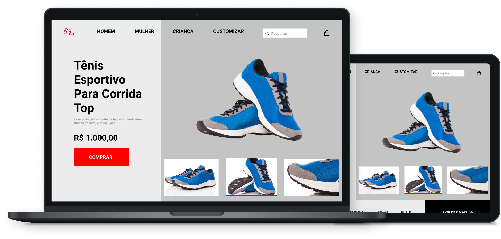

<h1 align="center">
    
</h1>

<p align="center">
    <a href="#-tecnologias">Tecnologias</a>&nbsp;&nbsp;&nbsp;|&nbsp;&nbsp;&nbsp;
    <a href="#-projeto">Projeto</a>&nbsp;&nbsp;&nbsp;|&nbsp;&nbsp;&nbsp;
    <a href="#-preview">Preview</a>&nbsp;&nbsp;&nbsp;|&nbsp;&nbsp;&nbsp;
    <a href="#-layout">Layout</a>&nbsp;&nbsp;&nbsp;|&nbsp;&nbsp;&nbsp;
    <a href="#-licença">Licença</a>
</p>

<p align="center">
  

  
  
  

  
</p>

<br>

<p align="center">
  
</p>

## 💻 Projeto
Esse projeto faz parte de uma coleção de desafios do curso Discover da Rocketseat. O objetivo do desafio foi desenvolver um mini e-commerce de calçados esportivos.

## 🧪 Tecnologias
Esse projeto foi desenvolvido com as seguintes tecnologias:

- HTML
- CSS

## 🔎 Preview
Quer dar uma olhadinha como ficou o projeto?

Acesse: [RocketShoes](https://guilhermequeico.github.io/rocketShoes/)

## 🚀 Como executar
Clone o projeto e acesse a pasta do mesmo.

```bash
$ git clone https://github.com/guilhermequeico/rocketShoes.git
$ cd rocketShoes
```
Agora é só abrir o arquivo <i>index.html</i> em seu navegador favorito.

## 📝 Licença
Esse projeto está sob a licença MIT. Veja o arquivo [LICENSE](LICENSE) para mais detalhes.

---
